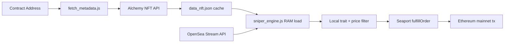

# nft-sniper-bot

[](./LICENSE)
[](https://nodejs.org/)
[](./CONTRIBUTING.md)
[](#disclaimer)

A metadata scraper and single-flight NFT sniper bot for EVM chains. Features dynamic trait selection and OpenSea Stream API integration to automatically detect and secure undervalued listings.

## High-Level Overview

This project is built as a **2-phase low-latency architecture**:

1. **Metadata Caching (Pre-Compute)**
   - [`fetch_metadata.js`](./fetch_metadata.js) uses Alchemy SDK to fetch all NFT metadata for a contract.
   - Metadata is normalized and stored in **`data_nft.json`**.
   - Collection slug is auto-resolved from contract metadata and printed to console (`COLLECTION_SLUG=...`) when available.

2. **Real-Time Sniping (Execution Path)**
   - [`sniper_engine.js`](./sniper_engine.js) loads `data_nft.json` into RAM.
   - Listens to OpenSea Stream `ItemListed` events over WebSocket.
   - Filters by trait + max price locally in memory.
   - Executes Seaport fulfillment using **ethers.js v6** with gas-fee buffering.

### Why this is fast

- No listing REST fetch in the critical execution path.
- Trait validation is local (RAM lookup), not remote API lookup.
- Single-flight guard prevents duplicate in-flight fills on the same order.

## Key Features

- **Stream-first detection** via OpenSea Stream API (`ItemListed`).
- **Local trait + price filtering** from `data_nft.json`.
- **Single-flight execution guard** (`inFlightOrderHashes`, `boughtOrderHashes`).
- **Dynamic trait targeting** via `TARGET_CONFIG.targetTraits`.
- **EIP-1559 gas strategy** with buffered `maxPriorityFeePerGas` / `maxFeePerGas` from `provider.getFeeData()`.
- **Auto contract-to-slug discovery** in metadata pre-computation.

## Prerequisites

- **Node.js** 18+ (recommended)
- **npm**
- **Git**
- **Alchemy API key**
- **OpenSea API key**
- **Ethereum RPC endpoint** (mainnet)
- **Funded wallet private key** for live execution

## Installation & Setup

```bash
git clone https://github.com/<your-username>/nft-sniper-bot.git
cd nft-sniper-bot
npm install
cp .env.example .env
```

Fill `.env` with your real values.

### Environment Variables

Required:

- `ALCHEMY_API_KEY`
- `OPENSEA_API_KEY`
- `RPC_URL`
- `PRIVATE_KEY`

Optional tunables:

- `BUYER_ADDRESS`
- `COLLECTION_SLUG`
- `MAX_PRICE_ETH`
- `GAS_BUFFER_BPS`

## Usage

### 1) Build metadata cache (run first)

Default contract from script:

```bash
node fetch_metadata.js
```

Custom contract:

```bash
node fetch_metadata.js 0xYourContractAddress
```

Expected output:

- Generates `data_nft.json`
- Prints resolved slug when available:

```text
COLLECTION_SLUG=your-collection-slug
```

### 2) Start sniper engine

```bash
node sniper_engine.js
```

### Recommended run order

1. Run metadata fetcher (`fetch_metadata.js`)
2. Confirm `data_nft.json` is generated and current
3. Start sniper engine (`sniper_engine.js`)

## Architecture



## Configuration Notes

- Trait and price logic live in `TARGET_CONFIG` inside [`sniper_engine.js`](./sniper_engine.js).
- Metadata source for engine is hardcoded to `./data_nft.json`.
- Gas competitiveness is controlled by `GAS_BUFFER_BPS`.

## Security & Operational Notes

- Never expose `PRIVATE_KEY` in source control, logs, screenshots, or client-side apps.
- `.env` must stay private and uncommitted.
- Start with a dedicated low-balance wallet for initial testing.
- Use conservative `MAX_PRICE_ETH` and validate trait filters before going live.
- Monitor gas market conditions; buffered gas settings can still fail in extreme spikes.
- On-chain transactions are irreversible once mined.

## Disclaimer

> **Educational use only.**
>
> Running trading bots on mainnet carries real financial risk, including but not limited to:
>
> - failed transactions and gas loss,
> - unfavorable fills or missed opportunities,
> - smart contract, marketplace, and infrastructure risks.
>
> You are solely responsible for any losses, configuration mistakes, or operational outcomes.

## Contributing

Issues and pull requests are welcome. Keep changes focused, tested, and clearly documented.

## License

This project is licensed under the **ISC** license (as declared in `package.json`).
